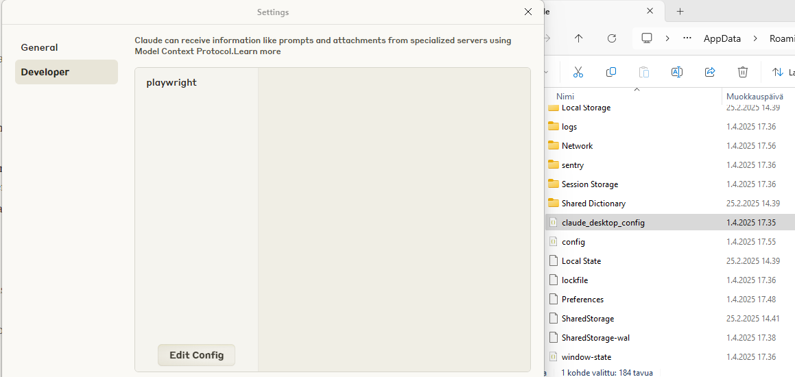

# Playwright MCP: Browser Automation for AI Models

This tutorial focuses specifically on setting up **Playwright MCP**, Microsoft's official browser automation server that implements the Model Context Protocol (MCP). The Model Context Protocol is an open standard that enables AI models (like Claude and GPT) to use tools and data sources in a standardized way.

## What is Playwright MCP?

Playwright MCP is Microsoft's official MCP server that gives AI models the ability to control web browsers. Unlike screenshot-based approaches, it provides structured accessibility snapshots of web pages for more efficient and reliable interactions.

Key features:

- Web navigation and searching
- Form filling and submission
- Data extraction from websites
- Screenshot capture
- Click, type, and other UI interactions
- Browser history navigation

## Setting up Playwright MCP

Playwright MCP gives AI models the ability to navigate websites, fill forms, extract data, and interact with web applications.

## Prerequisites

Before starting, you'll need:

1. **Claude Desktop** - Download from [claude.ai/download](https://claude.ai/download)
2. **Node.js** - Playwright MCP requires Node.js to be installed on your system
   - Download from [nodejs.org](https://nodejs.org/)
   - Includes npm and npx which are needed to run Playwright

You don't need to manually install Playwright - the configuration will automatically download and install it the first time you use it.

### Opening the Configuration File

You can open the configuration file in PowerShell:

```powershell
code $env:AppData\Claude\claude_desktop_config.json
```

Alternatively, you can open it with any text editor like VSCode or Notepad by navigating to:
`%AppData%\Claude\claude_desktop_config.json`

Or directly in Claude Desktop:

1. Open Claude Desktop
2. Open the settings menu via the Claude icon
3. Select "Settings..."
4. Click "Developer" in the sidebar
5. Click the "Edit Config" button

#### Adding Playwright MCP Server

Add the following configuration to the file:

```json
{
  "mcpServers": {
    "playwright": {
      "command": "npx",
      "args": ["@playwright/mcp@latest", "--headless"]
    }
  }
}
```

Save the file and restart Claude Desktop.




### 2. Using Playwright MCP

Once configured, you can ask Claude to use the browser, for example:

- "Could you open the browser and go to the Haaga-Helia website (www.haaga-helia.fi), take a screenshot, and tell me what you see on the homepage?"

## MCP Ecosystem

The MCP protocol is supported by e.g:

- **Claude Desktop** (Anthropic)
- **Microsoft Copilot Studio** (Microsoft)
- **VS Code GitHub Copilot** (GitHub/Microsoft)
- **OpenAI Agents SDK** (OpenAI)

MCP servers can be created in multiple programming languages:

- Python SDK
- TypeScript SDK
- Java SDK
- C# SDK
- Kotlin SDK

## Example MCP Servers

There are hundreds of MCP servers available covering various use cases. You can find a comprehensive list at [awesome-mcp-servers](https://github.com/punkpeye/awesome-mcp-servers).

Here are a few examples of different types:

| Category               | Examples                              |
| ---------------------- | ------------------------------------- |
| Browser Automation     | Playwright MCP (Microsoft), Puppeteer |
| File System Access     | Filesystem MCP                        |
| Search                 | Brave Search, DuckDuckGo MCP          |
| Databases              | PostgreSQL MCP, SQLite MCP            |
| Code & Version Control | GitHub MCP, Git MCP                   |
| Cloud Services         | AWS MCP, Kubernetes MCP               |

## Additional Resources

- [Model Context Protocol documentation](https://modelcontextprotocol.io/)
- [Playwright MCP GitHub](https://github.com/microsoft/playwright-mcp)
- [MCP Python SDK](https://github.com/modelcontextprotocol/python-sdk)

## Playwright MCP Prompt Examples for Business Use

### Legal & Compliance

- "Search finlex.fi for recent changes to Finnish employment law"
- "Find GDPR compliance requirements for Finnish businesses"
- "Research environmental regulations for manufacturing companies in Finland"
- "Find tax reporting deadlines for businesses in Finland this year"

### Research & Market Analysis

- "Check competitor product pricing and create a comparison report"
- "Analyze digital healthcare trends in Nordic markets"
- "Monitor currency exchange rates affecting our exports"
- "Research public tender opportunities for our company"

### Education & Training

- "Find relevant IT training courses on opintopolku.fi for our development team"
- "Check upcoming business administration programs at Haaga-Helia"
- "Find continuing education options for healthcare professionals in Helsinki"
- "Research available language courses for employees relocating to Finland"

### Public Services & Information

- "Check today's lunch menu at Compass Group's Opetustalo restaurant"
- "Find business support services available through Business Finland"
- "Research available funding opportunities for cleantech companies"
- "Find the application process for startup grants in Helsinki"

### Operations & Logistics

- "Check current shipping delays between Finland and Germany"
- "Find warehousing options near Helsinki port"
- "Research suppliers of sustainable packaging in Finland"
- "Monitor weather forecasts affecting shipment routes"

### Customer & Market Research

- "Gather customer reviews about our main product from Finnish forums"
- "Research local consumer preferences for sustainable products"
- "Check social media sentiment about our recent product launch"
- "Analyze user reviews of similar products in the Finnish market"
